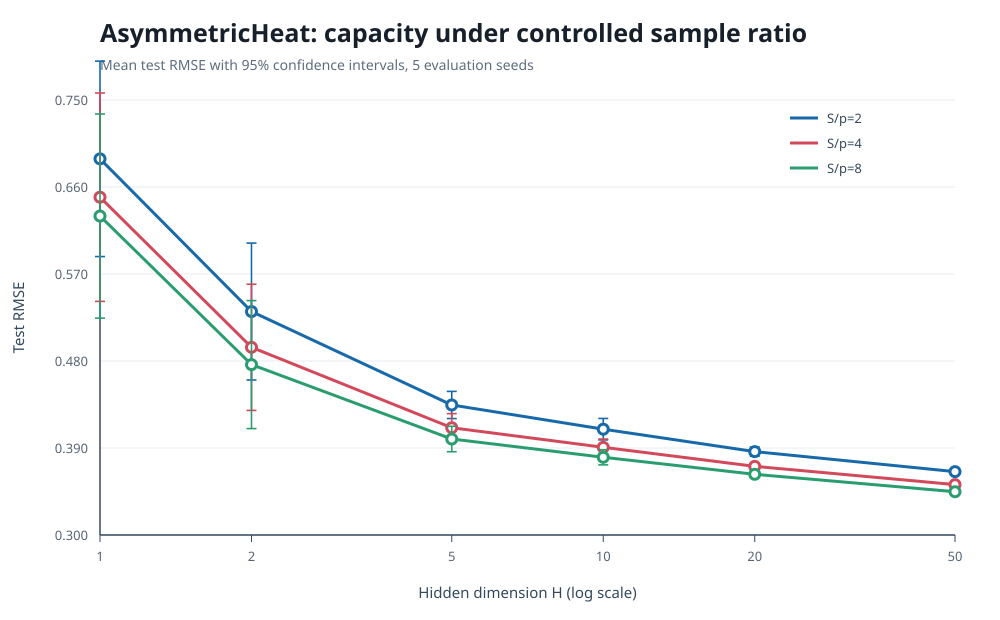
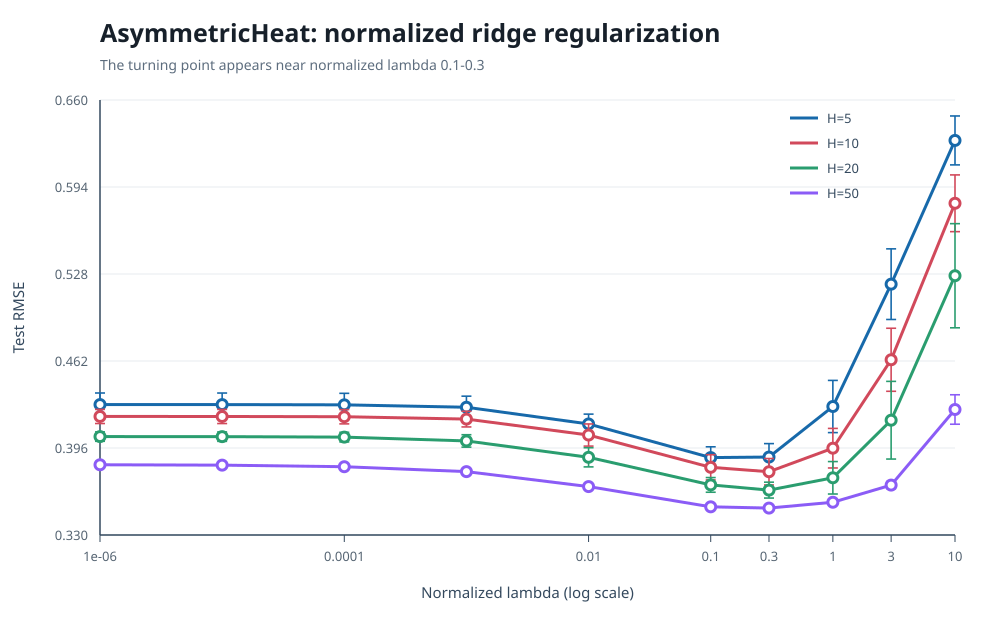
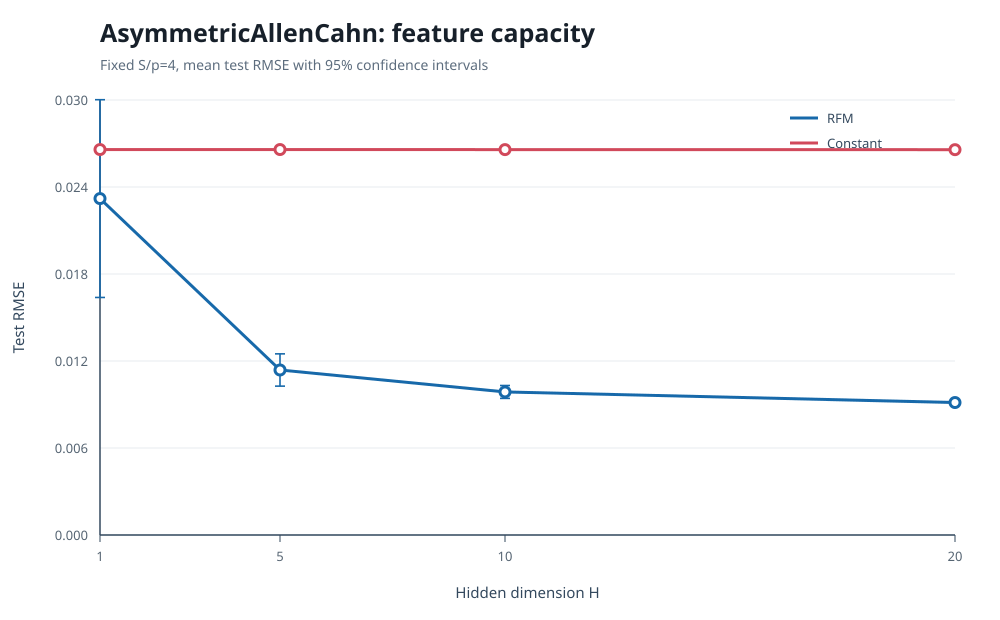
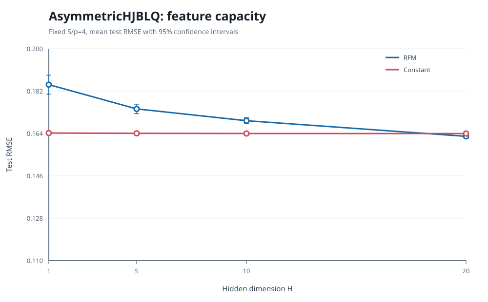
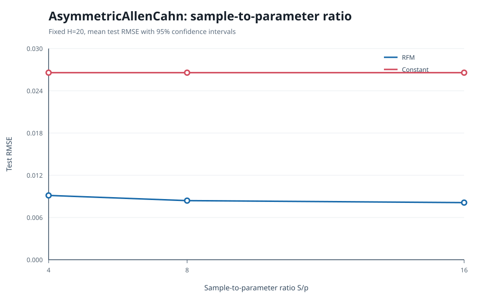
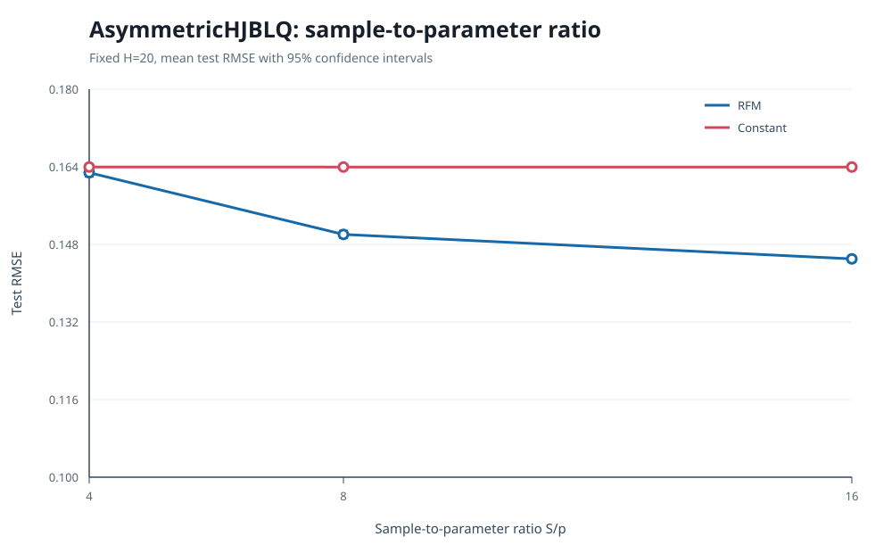

# 弱对称高维 PDE 随机特征实验综合分析

生成日期: 2026-07-14.

## 执行摘要

- 在 AsymmetricHeat 上固定 $S/p=8$ 后, $H$ 从 1 增加到 50, Test RMSE 从 `0.6299` 降至 `0.3448`, 降幅为 `45.3%`.
- 归一化 ridge 正则化的最优区间不再位于扫描边界. $H=5$ 取 $\bar\lambda=0.1$, $H\ge10$ 的最优值集中在 $\bar\lambda=0.3$.
- AsymmetricAllenCahn 在 $H=20,S/p=4$ 时 Test RMSE 为 `0.00914`, constant 为 `0.02657`, RFM 消除了约 `88.2%` 的基线 MSE.
- AsymmetricHJBLQ 更困难. $H=20,S/p=4$ 时 RFM 仅略优于 constant (`0.16278` 对 `0.16396`), 但将 $S/p$ 提高到 16 后 Test RMSE 降至 `0.14501`.
- 整体证据表明, 方法收益不是由径向对称性或仅估计 $y_0$ 造成的. 随机特征主要改善路径级 $Z$ 表示, 但需要让样本数随参数数目同步增长.

## 1. AsymmetricHeat: 容量与样本规模

| $H$ | $p$ | RMSE, $S/p=2$ | RMSE, $S/p=4$ | RMSE, $S/p=8$ |
|---:|---:|---:|---:|---:|
| 1 | 101 | 0.6891 | 0.6495 | 0.6299 |
| 2 | 201 | 0.5312 | 0.4941 | 0.4763 |
| 5 | 501 | 0.4345 | 0.4109 | 0.3993 |
| 10 | 1001 | 0.4095 | 0.3907 | 0.3804 |
| 20 | 2001 | 0.3863 | 0.3710 | 0.3628 |
| 50 | 5001 | 0.3655 | 0.3521 | 0.3448 |

固定 $S/p$ 后, Test RMSE 随 $H$ 单调下降. 这修正了早期固定 $S$ 实验中大 $H$ 过拟合的假象. 当 $H=50$ 时, $S/p$ 从 2 增加到 8, Test RMSE 由约 `0.3655` 降至 `0.3448`, 说明样本不足和特征容量是两个独立因素.

## 2. AsymmetricHeat: 正则化转折

| $H$ | 最优 $\bar\lambda$ | 最优 Test RMSE |
|---:|---:|---:|
| 5 | 0.1 | 0.38872 |
| 10 | 0.3 | 0.37799 |
| 20 | 0.3 | 0.36406 |
| 50 | 0.3 | 0.35042 |

较大的 raw lambda 本身没有可比意义. 当前目标应按 $\lambda=S\bar\lambda$ 理解. 当 $\bar\lambda$ 从最优区间继续增加到 1, 3, 10 时, 训练误差和测试误差同时上升, 表明模型开始发生过度收缩. 因此 ridge 的收益来自有限的偏差-方差折中, 而不是正则化越大越好.

## 3. 弱对称非线性方程: 特征容量

### AsymmetricAllenCahn

Allen-Cahn 在 $H=1$ 时对 seed 较敏感, 但从 $H=5$ 开始稳定优于 constant. $H=20$ 时 Test RMSE 约为 `0.00914`, 而 constant 约为 `0.02657`. 这是目前最强的非线性有效性证据.

### AsymmetricHJBLQ

HJB 的二次 driver 放大了 $Z$ 的估计误差. 在固定 $S/p=4$ 时, Test RMSE 随 $H$ 从 1 到 20 单调下降, 但直到 $H=20$ 才刚刚超过 constant. 这说明优化能够降低训练残差, 但统计误差仍占主导.

## 4. 非线性方程: 增大 $S/p$

### AsymmetricAllenCahn

固定 $H=20$ 后, $S/p$ 从 4 增加到 16, Test RMSE 从 `0.00914` 降至 `0.00811`. 对应基线 MSE 降低率从 `88.2%` 提升到 `90.7%`. 训练与测试误差已经接近, 继续增加样本的边际收益有限.

### AsymmetricHJBLQ

HJB 的 Test RMSE 从 `0.16278` 降至 `0.14501`. 配对差值为 `-0.01777 +/- 0.00079`, 明显超过随机波动. 相对 constant 的 MSE 降低率从约 `1.4%` 提升到 `21.8%`. 因此此前 HJB 表现弱的主要原因之一是 $S/p=4$ 仍不足.

## 5. 综合判断

| 方程 | 主要观察 | 当前瓶颈 |
|---|---|---|
| AsymmetricHeat | 固定 $S/p$ 后, 增大 $H$ 稳定降低误差 | 中高频表示和时间离散 |
| AsymmetricAllenCahn | $H=20$ 消除约 88%-91% constant MSE | 已接近统计平台, 需要增加 $H$ 或时间步数 |
| AsymmetricHJBLQ | 增大 $S/p$ 后从几乎无收益提升到约 22% MSE 收益 | 表达误差和二次 driver 的非线性敏感性 |

现有实验支持以下结论: RFM 的优势主要体现在对路径依赖的 $Z_t$ 进行非平凡逼近, 而不是仅利用对称性估计一个标量 $y_0$. 但是 constant 只对应 $Z=0$, 仍属于较弱基线. 若要形成更强的论文证据, 还应加入 constant-$Z$、affine-$Z$ 和低阶 Hermite 基线.

## 6. 下一步实验优先级

1. 对 HJB 比较 $(H,S/p)=(20,32),(50,8),(50,16)$, 区分统计误差和表示误差.
2. 为 Heat 构造具有解析 $u$ 和 $Z$ 的多方向多频终端条件, 同时报告 terminal RMSE 与 $Z$ 的积分误差.
3. 扫描时间步数 $N$, 避免把高频末端条件的时间边界层误差归因于随机特征.
4. 加入参数量匹配的 affine/Hermite 基线, 证明收益来自随机特征表示而不只是非零 $Z$.

## 数据说明

报告使用 5 个 evaluation seed 计算均值和 95% 置信区间. Ridge 参数选择使用独立的 3 个 tuning seed. 所有 constant 对照均与相同训练规模和 seed 配对. 图中的误差棒表示跨 seed 的均值置信区间, 不代表单条路径上的 Monte Carlo 标准误差.
